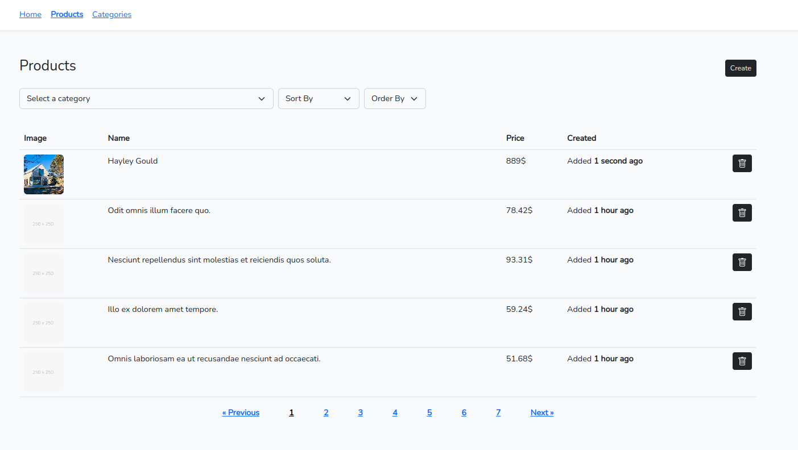

# Coding-Challenge-Full-Stack

PHP-Laravel, JS-VueJS project using Swagger OpenAPI

## Capture



## Starting Project

1. install laravel packs

```composer
composer install
```

1. Run the following command to create .env file and generate your app key:

```
cp .env.example .env
```


```bash
php artisan key:generate
```

2. Create the symbolic link:
```bash
php artisan storage:link
```

3. install npm and run

```npm
npm install
```

```npm
npm run dev
```

## Generate Data

```
php artisan db:seed
```

## CLI

- php artisan create:category --name="" --parent_category_id=""
- php artisan delete:category --id="" [--force]
- php artisan create:product --name="" --desc="" --price=""
- php artisan delete:product --id=""

## API Documentation

generate docs using `Swagger`;

```sh
php artisan l5-swagger:generate
```

[API Docs](http://127.0.0.1:8000/api/v1/documentation)

----- 
Need helps? Reach me out

> Email: soulaimaneyh07@gmail.com

> Linkedin: soulaimane-yahya

All the best :beer:
